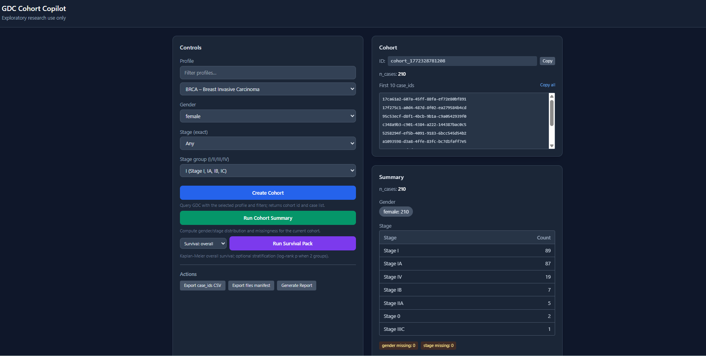
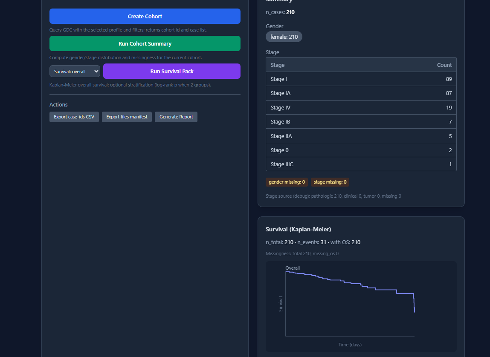

# GDC Cohort Copilot (v1)

**Create and explore TCGA cohorts from the NCI GDC with one-click summaries, survival curves, and exports.**

- **Cohort snapshots** — Define cohorts by cancer profile (BRCA, LUAD, COAD, and 15+ TCGA projects) plus optional filters (stage, gender); store as JSON under `data/`.
- **Cohort Summary** — Gender and stage distribution, missingness; canonical stage (pathologic → clinical → tumor) so filter and summary match.
- **Survival Pack** — Kaplan–Meier overall survival; optional stratification by gender or stage with log-rank p-value.
- **Exports** — Case IDs as CSV; GDC files manifest (TSV) for RNA-seq, somatic mutations, WXS.
- **Report** — Manual generation only: Markdown + printable HTML from latest artifacts (cohort, summary, survival, manifest); lists artifacts included.

**Disclaimer:** For **exploratory research use only**. Not for clinical or regulatory use.

---

## 🎯 Who it's for

- Researchers and clinician-scientists exploring TCGA/GDC cohorts.
- Students learning cohort definition and survival analysis.
- Anyone who needs reproducible, artifact-based workflows without a database.

## 💡 Why it exists

- **Pain points:** Ad-hoc GDC queries are hard to reproduce; stage fields differ across endpoints; survival data is spread across demographic and diagnoses.
- **Reproducibility:** Cohorts and runs are stored as JSON/TSV under `data/`; the report lists exactly which artifacts were used.
- **Canonical stage:** One rule (pathologic → clinical → tumor) for both filtering and summary so “Stage IIB” in the filter matches the summary table.
- **No DB:** v1 stays minimal—no Postgres, Docker, or ORM; all data from the public GDC API and local files.

## 🚀 What's included in v1

- 17+ TCGA profiles (BRCA, LUAD, COAD, LUSC, etc.) in `profiles/*.json`; extend by adding a JSON file.
- Profile search above the dropdown (filter by name or description).
- Create Cohort → Run Cohort Summary → Run Survival Pack (optional) → Export (CSV/TSV) → Generate Report (manual).
- Stage options from GDC (exact stage dropdown + stage group I/II/III/IV).
- GET /api/health, GET /api/profiles, GET /api/stage-options, POST /api/cohorts, POST /api/cohorts/:id/summary, POST /api/cohorts/:id/survival, export and report endpoints (see API section).

## 🖼️ Screenshots

*Add `ui-overview.png` and `ui-survival.png` into `docs/images/` to display them below.*

**Dashboard (controls + cohort + summary)**



**Survival (Kaplan–Meier curve and metrics)**



## 🧪 Quick start

**Requirements:** Node.js 18+, npm. Windows PowerShell:

```powershell
cd gdc-cohort-copilot-v1
npm install
npm run dev
```

Open **http://localhost:3000**. UI runs on port 3000; API on 3001 (configurable via `API_PORT`). If the API port is in use:

```powershell
$env:API_PORT=3002; npm run dev
```

**Verify:** `Invoke-RestMethod -Uri "http://localhost:3000/api/health"` → `ok: true`. `Invoke-RestMethod -Uri "http://localhost:3000/api/profiles"` → list of profiles.

## 🔐 Data access & privacy

- All cohort and summary data comes from the **public NCI GDC API** (https://api.gdc.cancer.gov). No patient-identifying data is stored; only case_ids, counts, and aggregate stats.
- **No database:** Snapshots, summaries, survival JSON, manifests, and reports are stored under `data/` (gitignored).
- **Files manifest:** Use “Export files manifest” to get a TSV of GDC file_ids for your cohort; use GDC’s gdc-client or portal to download files (open/controlled as per GDC).

## 🧱 How it works

1. **Profile** — Pick a TCGA project (e.g. BRCA) from `profiles/`; optionally filter by stage (exact or group) and gender.
2. **Cohort snapshot** — POST /api/cohorts queries GDC and saves `data/<id>.json` with case_ids.
3. **Artifacts** — Summary, survival, and manifest are optional; each writes to `data/<id>_summary.json`, `data/<id>_survival.json`, `data/<id>_manifest.tsv`.
4. **Report** — Click “Generate Report” to rebuild from disk; writes `data/<id>_report.md` and `data/<id>_report.html` and lists artifacts included.

## 🔌 API endpoints

| Method | Endpoint | Purpose |
|--------|----------|---------|
| GET | /api/health | Health check |
| GET | /api/profiles | Profiles (sorted by name) |
| GET | /api/stage-options?profileKey=... | Stage options for profile |
| POST | /api/cohorts | Create cohort |
| POST | /api/cohorts/:id/summary | Cohort summary |
| POST | /api/cohorts/:id/survival | Survival Pack (KM + optional stratification) |
| GET | /api/cohorts/:id/export/case_ids.csv | Export case IDs CSV |
| POST | /api/cohorts/:id/export/files-manifest | Export files manifest TSV |
| POST | /api/cohorts/:id/report | Generate report (rebuild from artifacts) |
| GET | /api/cohorts/:id/report.md | Download report Markdown |
| GET | /api/cohorts/:id/report.html | Preview report HTML |

See **Detailed API** below for request/response details.

## 📦 Exports

- **Case IDs CSV** — GET `/api/cohorts/:id/export/case_ids.csv`; header `case_id`, one row per case.
- **Files manifest TSV** — POST `/api/cohorts/:id/export/files-manifest` with `data_types`, optional `experimental_strategy`/`access`; returns TSV (file_id, file_name, md5sum, file_size, data_type, experimental_strategy, cases.case_id) and saves to `data/<id>_manifest.tsv`. UI offers presets (RNA-seq, Somatic mutations, WXS BAM).

## 📝 Report

- **Manual only:** The report is generated **only** when you click **Generate Report** (POST /api/cohorts/:id/report). It is never auto-generated after Create Cohort, Run Summary, or Run Survival Pack.
- **Content:** Rebuilt from latest artifacts on disk: cohort definition, “Artifacts included” (paths + last modified), summary tables (if summary exists), survival section (if survival exists), manifest section (if manifest exists), else “not generated yet”; disclaimer.
- **Outputs:** `data/<id>_report.md`, `data/<id>_report.html`. Preview (HTML) and Download (.md) links appear after generation; “Report last generated” shows the timestamp.

## 🛣️ Roadmap

- Genomics pack (e.g. mutation/expression summary by cohort).
- Trial matching (match cohort to eligibility criteria).
- Knowledge graph or cross-cohort comparison.
- Optional PDF export for reports.
- More GDC data types in manifest presets.

## Common issues

- **API port in use (EADDRINUSE):** Set another port: `$env:API_PORT=3002; npm run dev`. The UI proxy uses the same `API_PORT`.
- **Connection refused:** Ensure `npm run dev` is running and both Vite (3000) and the API (3001 or your `API_PORT`) show LISTENING in `netstat -an | findstr "3000 3001"`.

## Detailed API

**GET /api/profiles** — Returns profiles from `profiles/*.json`, sorted by name. Add a profile by creating e.g. `profiles/coad.json`: `{"id":"coad","name":"COAD","description":"Colon Adenocarcinoma","gdc_project_id":"TCGA-COAD"}`.

**GET /api/stage-options?profileKey=brca|luad|...** — Stage values and counts (canonical stage) for the profile.

**POST /api/cohorts** — Body: `{ "profileKey": "brca", "filters": { "stage": "Stage IIA", "gender": "female" } }`. Use `stage` (exact) or `stageGroup` ("I"|"II"|"III"|"IV"); stage takes precedence. Returns cohort with `id`, `n_cases`, `case_ids`; saves `data/<id>.json`.

**POST /api/cohorts/:id/summary** — Computes gender/stage (canonical) and missingness from GDC; saves `data/<id>_summary.json`. Optional debug: `stage_source_counts`.

**POST /api/cohorts/:id/survival** — Body: `{ "stratify_by": null | "gender" | "stage" }`. Fetches vital_status and days from demographic + diagnoses; returns `km_points`, `n_events`, missingness, debug counts; if stratified, `groups` and `p_value`. Saves `data/<id>_survival.json`. Returns 400 if &lt;10% of cases have OS time.

**Export:** GET `.../export/case_ids.csv`; POST `.../export/files-manifest` with `data_types` (array), optional `experimental_strategy`, `access`.

**Report:** POST `.../report` rebuilds from disk and returns `{ ok, generatedAt, artifactsIncluded }`. GET `.../report.md` and `.../report.html` serve the saved files (404 if not generated yet).

Errors from GDC are returned as 502 with `error` and `message`; the UI shows them in a red banner. No mock data; all numbers from GDC.

## Project layout

- `server.js` — Express API, GDC client, report builder
- `profiles/` — Profile JSON (brca, luad, coad, …); add files to extend
- `data/` — Cohorts, summaries, survival, manifests, reports (gitignored)
- `src/App.jsx` — Vite + React UI
- `docs/images/` — Screenshots (ui-overview.png, ui-survival.png)
